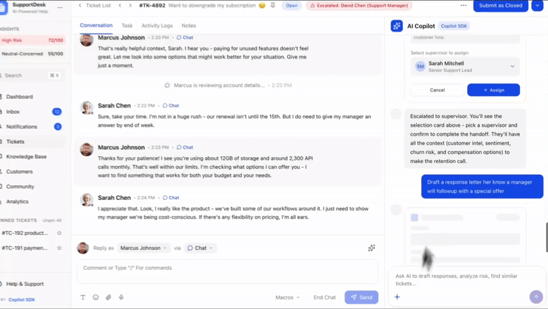

<div align="center">

# Copilot SDK

### Build AI Copilots for Your Product

Production-ready AI Copilots for any product. Connect any LLM, deploy on your infrastructure, own your data. Built for speed and control.

[](https://www.npmjs.com/package/@yourgpt/copilot-sdk)
[](https://www.npmjs.com/package/@yourgpt/copilot-sdk)
[](LICENSE)

[Documentation](https://copilot-sdk.yourgpt.ai)

<br />



</div>

<br />

## Quick Start

### Install

```bash
npm install @yourgpt/copilot-sdk @yourgpt/llm-sdk
```

### Frontend (React)

```tsx
import { CopilotProvider } from "@yourgpt/copilot-sdk/react";
import { CopilotChat } from "@yourgpt/copilot-sdk/ui";
import "@yourgpt/copilot-sdk/ui/styles.css";

function App() {
  return (
    <CopilotProvider runtimeUrl="/api/chat">
      <YourApp />
      <CopilotChat />
    </CopilotProvider>
  );
}
```

### Backend (Next.js)

```ts
// app/api/chat/route.ts
import { streamText } from "@yourgpt/llm-sdk";
import { openai } from "@yourgpt/llm-sdk/openai";

export async function POST(req: Request) {
  const { messages } = await req.json();

  const result = await streamText({
    model: openai("gpt-5"),
    system: "You are a helpful assistant.",
    messages,
  });

  return result.toTextStreamResponse();
}
```

<br />

## LLM SDK - Multi-Provider Support

Use any LLM provider with a unified API:

```ts
import { streamText } from "@yourgpt/llm-sdk";
import { openai } from "@yourgpt/llm-sdk/openai";
import { anthropic } from "@yourgpt/llm-sdk/anthropic";
import { google } from "@yourgpt/llm-sdk/google";
import { xai } from "@yourgpt/llm-sdk/xai";

// OpenAI
await streamText({ model: openai("gpt-5"), messages });

// Anthropic
await streamText({ model: anthropic("claude-sonnet-4-20250514"), messages });

// Google
await streamText({ model: google("gemini-2.0-flash"), messages });

// xAI
await streamText({ model: xai("grok-3"), messages });
```

### Server-Side Tools

Add tools to let the AI call functions on your server:

```ts
import { streamText, tool } from "@yourgpt/llm-sdk";
import { openai } from "@yourgpt/llm-sdk/openai";
import { z } from "zod";

const result = await streamText({
  model: openai("gpt-5"),
  messages,
  tools: {
    getWeather: tool({
      description: "Get current weather for a city",
      parameters: z.object({
        city: z.string().describe("City name"),
      }),
      execute: async ({ city }) => {
        const data = await fetchWeatherAPI(city);
        return { temperature: data.temp, condition: data.condition };
      },
    }),
  },
  maxSteps: 5,
});

return result.toDataStreamResponse();
```

<br />

## Packages

| Package                      | Description                              |
| ---------------------------- | ---------------------------------------- |
| `@yourgpt/copilot-sdk/react` | React hooks and provider                 |
| `@yourgpt/copilot-sdk/ui`    | Pre-built chat components                |
| `@yourgpt/copilot-sdk/core`  | Core utilities and context capture tools |
| `@yourgpt/llm-sdk`           | Multi-provider LLM SDK with streaming    |

<br />

## Documentation

Visit **[copilot-sdk.yourgpt.ai](https://copilot-sdk.yourgpt.ai)** for full documentation.

- [Getting Started](https://copilot-sdk.yourgpt.ai/docs)
- [Why Copilot SDK](https://copilot-sdk.yourgpt.ai/docs/why-copilot-sdk)
- [LLM SDK](https://copilot-sdk.yourgpt.ai/docs/llm-sdk)
- [Providers](https://copilot-sdk.yourgpt.ai/docs/providers)
- [API Reference](https://copilot-sdk.yourgpt.ai/docs/api-reference)

<br />

## Contributing

Have any feedback? Share it with us.

[@0fficialRohit](https://x.com/0fficialRohit) · [@rege_dev](https://x.com/rege_dev)

<br />

## License

[MIT License](./LICENSE)
