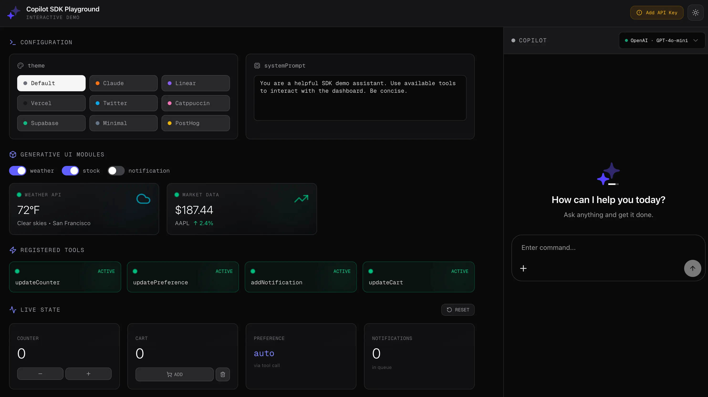

# Copilot SDK Playground

> Multi-provider testing playground for comparing LLM providers side-by-side.

[](https://vercel.com/new/clone?repository-url=https://github.com/YourGPT/yourgpt-copilot/tree/main/examples/playground&env=OPENAI_API_KEY,ANTHROPIC_API_KEY,GOOGLE_API_KEY&envDescription=Your%20LLM%20provider%20API%20keys&project-name=copilot-playground)



## Features Showcased

- **Multi-Provider Testing** - Compare OpenAI, Anthropic, Google, and xAI side-by-side
- **Theme Switcher** - Light/dark mode toggle
- **Settings Panel** - Adjust model parameters in real-time
- **Provider Selection** - Easy switching between providers

## Quick Start

### Prerequisites

- Node.js 18+
- At least one LLM provider API key

### Installation

```bash
# Clone the repository
https://github.com/YourGPT/copilot-sdk.git

cd copilot-sdk

# Install all dependencies from root (required for workspace)
pnpm install


cd copilot-sdk/examples/playground

# Install dependencies
pnpm install

# Set up environment
cp .env.example .env.local
# Add your API keys to .env.local

# Run development server
pnpm dev
```

Open [http://localhost:3000](http://localhost:3000)

## Deploy

[](https://vercel.com/new/clone?repository-url=https://github.com/YourGPT/yourgpt-copilot/tree/main/examples/playground&env=OPENAI_API_KEY,ANTHROPIC_API_KEY,GOOGLE_API_KEY&envDescription=Your%20LLM%20provider%20API%20keys&project-name=copilot-playground)

## Environment Variables

Create a `.env.local` file with your API keys:

```bash
OPENAI_API_KEY=your-openai-key
ANTHROPIC_API_KEY=your-anthropic-key
GOOGLE_API_KEY=your-google-key
XAI_API_KEY=your-xai-key
```

| Variable            | Description                |
| ------------------- | -------------------------- |
| `OPENAI_API_KEY`    | OpenAI API key (GPT-4o)    |
| `ANTHROPIC_API_KEY` | Anthropic API key (Claude) |
| `GOOGLE_API_KEY`    | Google AI API key (Gemini) |
| `XAI_API_KEY`       | xAI API key (Grok)         |

## API Routes

| Endpoint              | Provider  | Model  |
| --------------------- | --------- | ------ |
| `POST /api/openai`    | OpenAI    | GPT-4o |
| `POST /api/anthropic` | Anthropic | Claude |
| `POST /api/google`    | Google    | Gemini |
| `POST /api/xai`       | xAI       | Grok   |

## Project Structure

```
playground/
├── app/
│   ├── page.tsx                    # Main playground UI
│   ├── layout.tsx                  # Root layout
│   ├── globals.css                 # Tailwind styles
│   └── api/
│       ├── openai/route.ts
│       ├── anthropic/route.ts
│       ├── google/route.ts
│       └── xai/route.ts
├── components/
│   ├── ui/                         # UI components
│   └── CopilotSDKLogo.tsx
├── public/
│   └── playground-preview.webp
└── README.md
```

## Tech Stack

- Next.js 16
- React 19
- Tailwind CSS 4
- @yourgpt/copilot-sdk
- @yourgpt/llm-sdk
